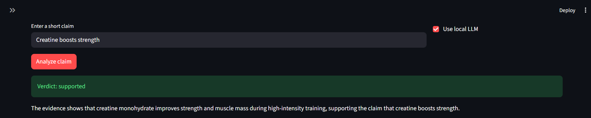
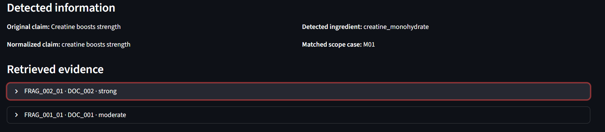
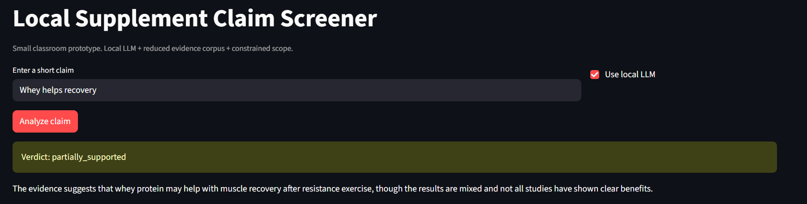
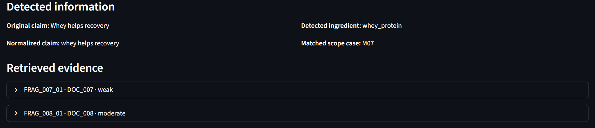
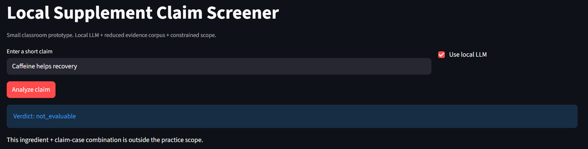
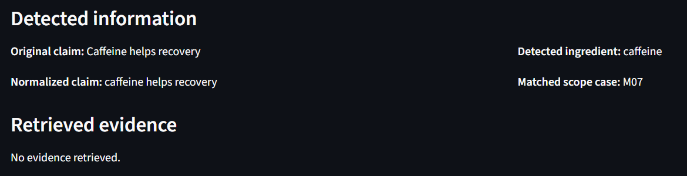
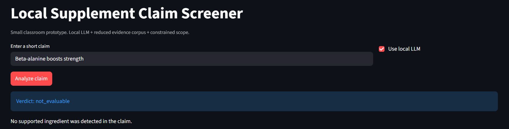
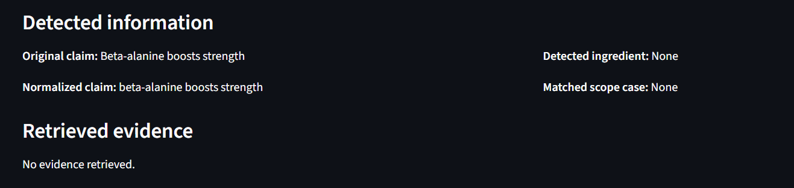

# Local Supplement Claim Screener  
## Technical Report

**Student:** Yago Ramos

---

## 1. Problem Description

In this practice, I developed a small local NLP application called **Local Supplement Claim Screener**. The goal of the project was to build a simple system that can analyze short claims about sports supplements and return a provisional verdict. This practice is related to my general project on supplement claim verification, but this version is much smaller and more limited.

The idea is simple. A user writes a short claim such as **"Creatine boosts strength"** or **"Whey helps recovery"**. Then the application processes the text, detects the ingredient, checks if the claim is inside the supported scope, retrieves small evidence fragments from a reduced corpus, and returns a structured result.

This is not a full scientific fact-checking system. It is a reduced classroom prototype. I limited the scope on purpose so the system would be easier to implement, easier to test, and easier to explain.

The practice only supports three ingredients:

- `creatine_monohydrate`
- `caffeine`
- `whey_protein`

It also only supports four claim cases:

- creatine + strength
- caffeine + fatigue / energy
- whey + recovery
- whey + muscle growth / lean mass

The system only returns three possible verdicts:

- `supported`
- `partially_supported`
- `not_evaluable`

---

## 2. System Design and Workflow

I designed the system as a small hybrid pipeline. I did not leave the full task to the language model. Instead, I used simple deterministic steps for the parts that are easy to control, and I used the local LLM only for the short explanation.

The workflow is the following:

1. The user enters a short claim in the Streamlit GUI.
2. The system normalizes the text.
3. The system detects the ingredient using a small lexicon.
4. The system detects the claim case using simple rule-based patterns.
5. The system checks if the combination is inside the supported scope.
6. The system retrieves one or two evidence fragments from the reduced corpus.
7. The system builds a prompt for the local LLM.
8. The model returns a short explanation.
9. The final structured result is displayed in the GUI.

This workflow was a good choice for the assignment because it is small but still shows a real NLP pipeline. It goes beyond a simple prompt-response demo and includes preprocessing, retrieval, scope control, local model use, and structured output.

---

## 3. Model Selection and Justification

For the local model, I used **qwen2.5:3b** with **Ollama**.

I selected this model for practical reasons. First, it can run locally on a normal student computer without needing too many resources. Second, it is good enough for a small controlled task like this one, where the output is short and simple. Third, it works well with Python through the local Ollama API.

I also used a local model because this was one of the main requirements of the assignment. I wanted the application to work without depending on an external cloud API. This makes the prototype more reproducible and more aligned with the idea of a local classroom project.

I did not choose a larger model because the task itself is small. In this case, using a bigger model would add more complexity without adding much value.

---

## 4. Implementation Details

The application was implemented in **Python**. I used **Streamlit** to build the GUI because it is simple, fast to develop, and enough for a small end-user interface. The interface includes a text input box, an analyze button, a checkbox to enable the local LLM, and result sections for the verdict, explanation, detected information, and retrieved evidence.

The project uses these main files:

- `app.py` for the Streamlit interface
- `utils.py` for the processing logic
- `prompt_template.txt` for the LLM prompt
- CSV files for the reduced corpus and scope data

In the code, I first normalize the input text. Then I detect the ingredient using a reduced lexicon. After that, I detect the claim case with simple keyword rules. If the claim is inside the allowed scope, the system retrieves one or two evidence fragments from the CSV file.

One important design decision was to keep the verdicts stable. For this class version, the verdict is assigned from the reduced scope logic:

- `M01` → `supported`
- `M04` → `supported`
- `M07` → `partially_supported`
- `M08` → `partially_supported`

This means the LLM does not decide unstable verdicts. Instead, it only helps generate a short explanation based on the evidence. I used this solution because it makes the application more consistent and easier to defend.

---

## 5. Discussion of Results

The application worked correctly for the main in-scope examples. For example, **"Creatine boosts strength"** returned `supported`, and **"Whey helps recovery"** returned `partially_supported`. The app also handled out-of-scope cases correctly, such as unsupported ingredients or invalid ingredient-claim combinations.

A positive result of this project is that the app does not simply answer everything. It can also return `not_evaluable` when the claim is outside the small supported scope. This is important because it makes the system more honest and more controlled.

Another positive result is that the project includes more than just a model call. It combines rule-based detection, reduced retrieval, local LLM usage, and a GUI. This gives the practice more academic value than a very basic chatbot demo.

At the same time, the system has clear limitations. The corpus is very small, the supported ingredients are limited, and the supported claim cases are very narrow. The app does not generalize to broader scientific verification tasks, and it should not be interpreted as a medical or scientific authority.

---

## 6. Limitations

This project has several limitations.

First, it only supports three ingredients and four claim cases. Any claim outside this reduced matrix is marked as `not_evaluable`.

Second, the evidence base is small. This was intentional for the assignment, but it also means the application has limited coverage.

Third, the retrieval method is simple. I did not use embeddings or a more advanced semantic search method because the practice was designed to remain small and realistic.

Fourth, the system is a classroom prototype, not a real verification platform. The verdicts are provisional and depend on the reduced corpus prepared for the exercise.

---

## 7. Possible Improvements

If I extended this project in the future, I would make a few improvements.

I would add more supported ingredients and more claim cases. I would also improve the retrieval component, for example by testing a better ranking strategy or a semantic method in a later version. Another useful improvement would be a small evaluation table with expected and observed outputs.

I would also connect this reduced practice more directly to the future final project on supplement claim verification. However, for this assignment, I think the current size of the project was appropriate.

---

## 8. Conclusion

In conclusion, this practice allowed me to build a small but complete local NLP application. The system takes a short supplement claim, processes it through a reduced pipeline, retrieves evidence, and returns a structured answer in a GUI.

I think this project satisfies the requirements of the assignment because it includes:

- a local LLM
- a GUI
- a language-related task
- additional NLP steps beyond prompt-response
- a clear and limited workflow
- a small but defendable implementation

The final result is simple, realistic, and aligned with the broader topic of my course project.

---

## 9. Screenshots of the Application

> Important: for the professor to see the images correctly, this report should stay inside the `report/` folder and the screenshots should stay inside the `screenshots/` folder.  
> These image paths are written as relative paths from `report/report.md`.

### 9.1 Supported example

**Figure 1. Supported claim result**  

**Figure 2. Supported claim detected information and evidence**  

### 9.2 Partially supported example

**Figure 3. Partially supported claim result**  

**Figure 4. Partially supported claim detected information and evidence**  

### 9.3 Not evaluable examples

**Figure 5. Not evaluable result for out-of-scope ingredient + claim case**  

**Figure 6. Not evaluable detected information**  

**Figure 7. Not evaluable result for unsupported ingredient**  

**Figure 8. Not evaluable detected information for unsupported ingredient**  

